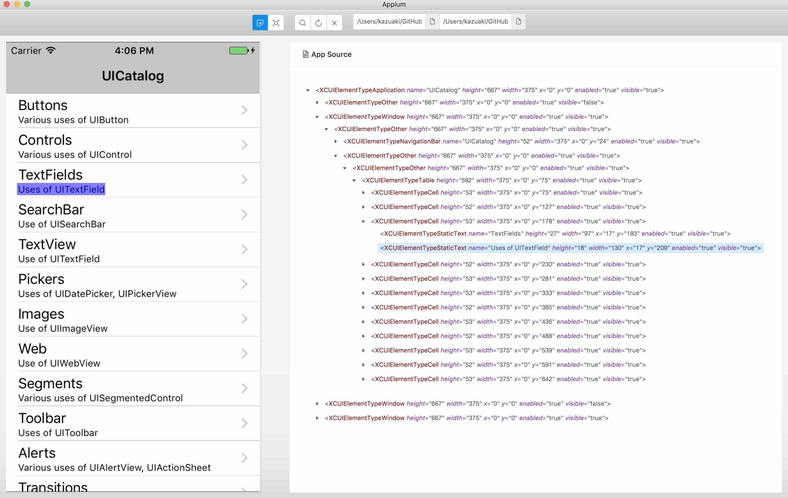

# appium-error-screen-source

Load image and Appium source tree from local machine and show them.



# How to use
## Download binary
1. Download binary from [release](https://github.com/KazuCocoa/appium-error-screen-source/releases) page
2. Launch the binary
3. Select the target png file and source file
   - You can select `docs/sample/sample.png` and `docs/sample/source.xml` as an example.
4. **reload** 

## Clone this repository
1. Clone this repository
2. `npm run dev` and select the target png file and source file
3. **reload** 

# Create a package

```
$ npm run package-all
```

# License
Apache 2.0

Inspired by [Appium-Desktop](https://github.com/appium/appium-desktop)

