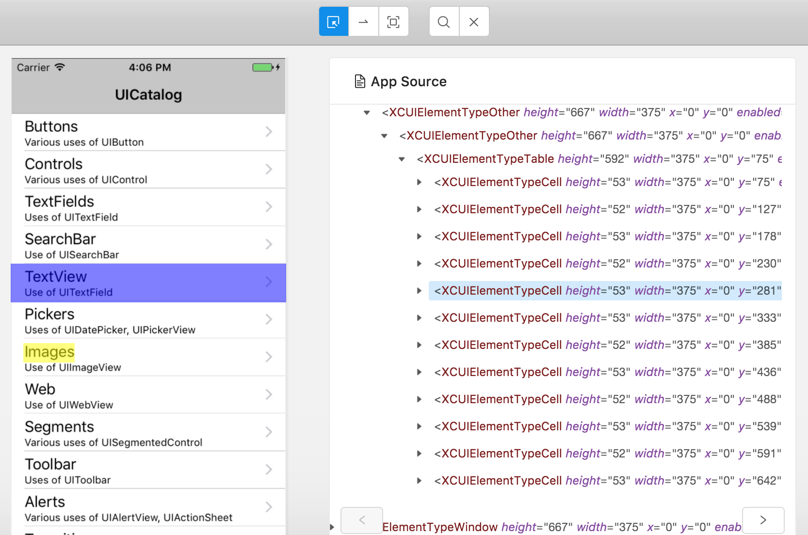

# Experimental

Load image and source tree from local machine and show them.

- `getScreenshotFile` in `app/renderer/components/Inspector/Screenshot.js`
- `loadXml` in `/Users/kazuaki/GitHub/appium-desktop/app/renderer/actions/Inspector.js`
